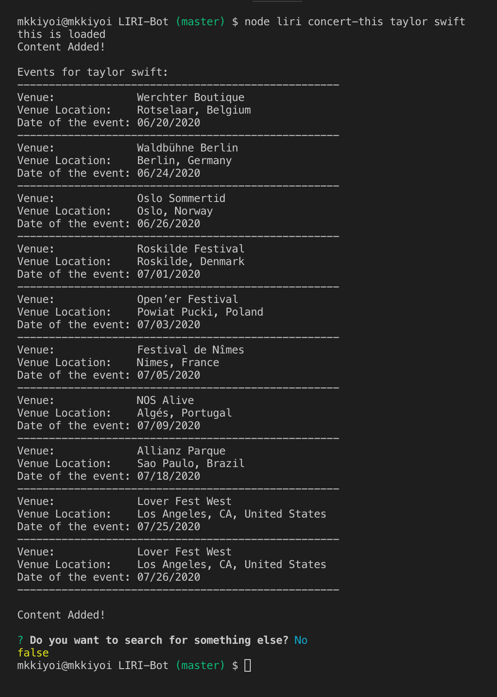
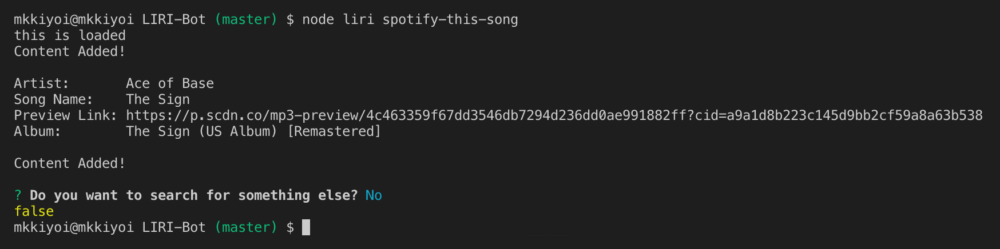
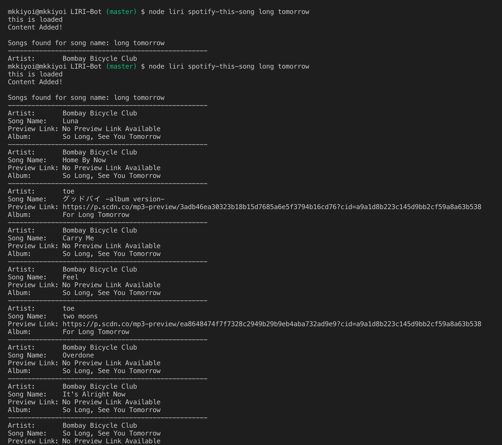
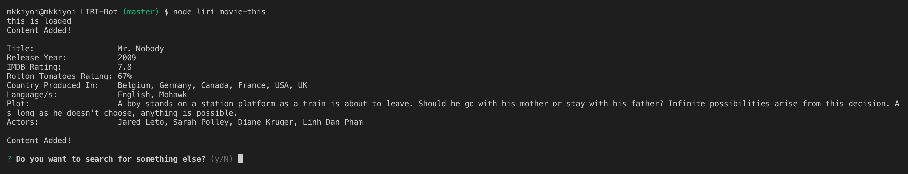
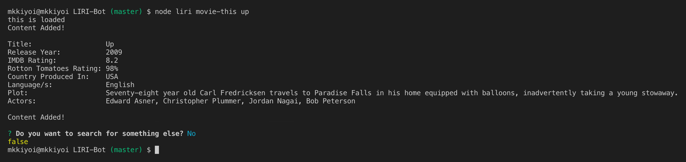
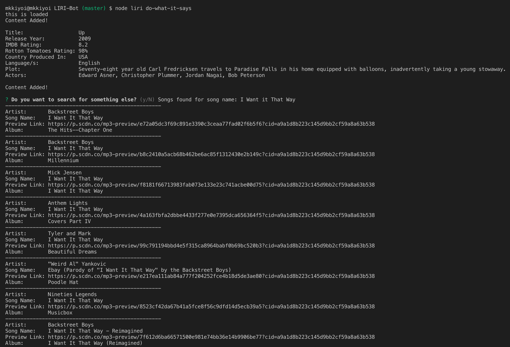
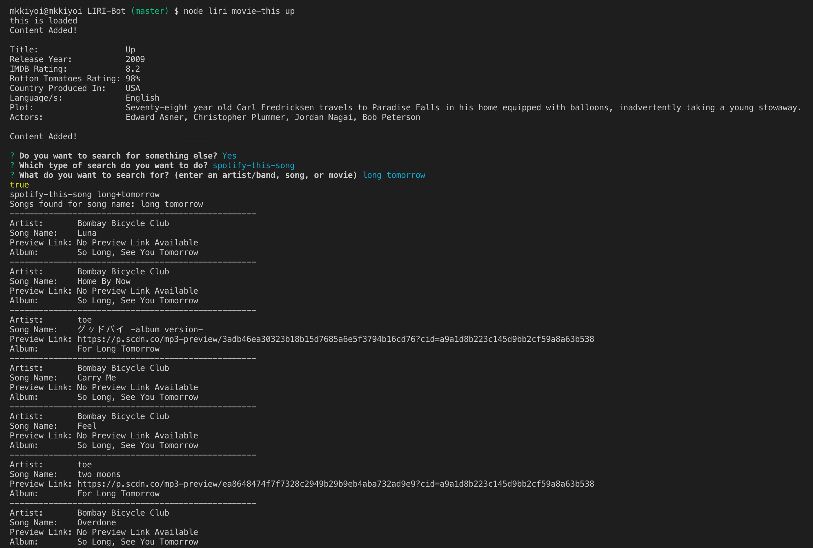

# LIRI-Bot

## __What is LIRI Bot?__
* LIRI (Language Interpretation and Recognition Interface) Bot is a command line node application that takes in one of four commands and outputs data corresponding to given user input.
* LIRI Bot Commands are as follows:
  * `concert-this '<artist/band name>'`
    * Returns information including venue, venue location, and date about upcoming concerts for a given artist or band.
  * `spotify-this-song '<song name>'`
    * Returns information including artist, song name, Spotify preview link, and album name that the song appears on.
  * `movie-this '<movie name>'`
    * Returns information including title, release year, IMDB rating, Rottten Tomatoes Rating, country produced in, languages, plot, and actors for the given movie.
  * `do-what-it-says`
    * Returns information pertaining to the command stored in random.txt. 
    

## __Using LIRI Bot__

* To use LIRI Bot, navigate to the directory containing [liri.js](liri.js). 
* Before you can run liri.js, you will need to obtain a Spotify API client key and secret. 
  * After obtaining the client key and secret, create a `.env` file containing
  ```js
  # Spotify API keys
  SPOTIFY_ID=your-spotify-id
  SPOTIFY_SECRET=your-spotify-secret
  ```
* Now that the .env file has been created, you can run the function as follows:
  * `node liri.js '<command> <user input>'`
* User input is either an artist/band, song name, or movie name.
* After a search has returned successfully, `liri.js` will output the desired information to both the console and to a file `output.js`. 
* At the very end, the node application will use `inquirer` to ask the user if they want to search again.


__NOTE__: All files, including the .env file, must be located in the same directory. 


## __Examples Using LIRI Bot__

`node liri concert-this taylor swift`


`node liri spotify-this-song`


`node liri spotify-this-song long tomorrow`


`node liri movie-this`


`node liri movie-this up`


`node liri do-what-it-says`


`node liri movie-this up` + `spotify-this-song long tomorrow`



## __Node Modules used in LIRI Bot__
* [dotenv](https://www.npmjs.com/package/dotenv/)
* [node-spotify-api](https://www.npmjs.com/package/node-spotify-api)
* [axios](https://www.npmjs.com/package/axios)
* [moment](https://www.npmjs.com/package/moment)
* [fs](https://nodejs.org/api/fs.html)
* [inquirer]((https://www.npmjs.com/package/inquirer))

## __Assets__
* Javascript for the node application can be found [here](liri.js).
* Spotify key handling can be found [here](keys.js).

